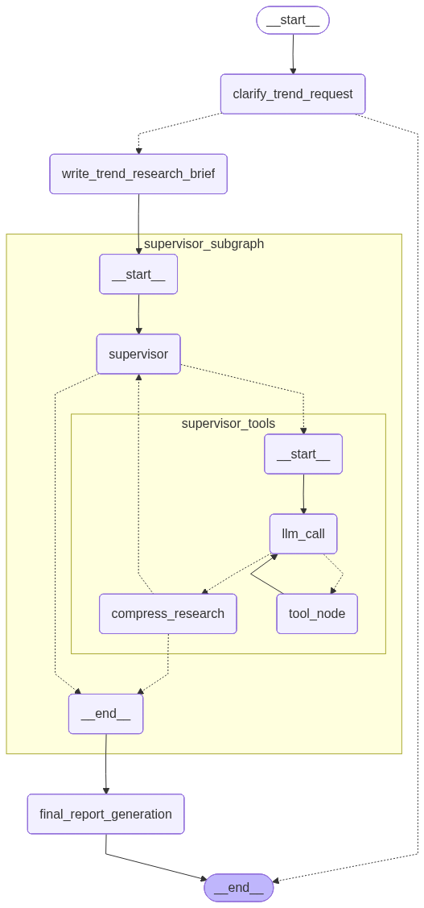

# TrendScope

An intelligent multi-agent deep research system that conducts comprehensive trend analysis using LangGraph workflows.

## Overview

TrendScope is a sophisticated deep research agent that helps users understand trends in any domain through automated web research, analysis, and report generation. The system uses multiple specialized agents working together to conduct thorough, multi-layered research that goes beyond surface-level information to provide comprehensive trend insights from various sources.

## Features

- **Deep Research Capabilities**: Goes beyond surface-level information to conduct thorough, multi-layered analysis
- **Beautiful Terminal UI**: Rich, colorful interface with progress indicators, styled panels, and professional formatting
- **Interactive Clarification**: Automatically asks for additional details when research scope is unclear
- **Multi-Agent Architecture**: Uses specialized research agents working in parallel for comprehensive coverage
- **Trend-Focused Analysis**: Specifically designed to identify current, emerging, and declining trends with supporting evidence
- **Comprehensive Reports**: Generates detailed reports with proper citations, source references, and in-depth analysis
- **Automatic File Output**: Saves reports to `final_reports/` folder with intelligent filename generation
- **Parallel Research Execution**: Conducts multiple research streams simultaneously for faster, more thorough results
- **Strategic Research Planning**: Uses reflection tools to plan research approaches and assess information gaps
- **Flexible Input**: Handles various research topics with automatic scope refinement

## Architecture

The system consists of several key components:



### Core Workflow
1. **Clarification Agent** (`clarify_trend_request`) - Determines if user input needs clarification
2. **Brief Generation** (`write_trend_research_brief`) - Converts user requests into structured research briefs  
3. **Supervisor Agent** (`supervisor_subgraph`) - Coordinates multiple research sub-agents
4. **Report Generation** (`final_report_generation`) - Synthesizes findings into comprehensive reports

### Agent Types
- **Trend Research Scope Agent** - Initial request processing and clarification
- **Lead Researcher/Supervisor** - Research coordination, task delegation, and strategic planning
- **Deep Research Sub-Agents** - Specialized web research with multi-layered analysis capabilities
- **Report Generator** - Comprehensive synthesis and professional formatting
- **Reflection Agents** - Strategic planning and research gap assessment

## Installation

1. Clone the repository:
```bash
git clone <repository-url>
cd trend-scope
```

2. Install dependencies:
```bash
pip install -r requirements.txt
```

3. Set up environment variables in `.env`:
```env
LLM_PROVIDER=google_genai
LLM_MODEL=gemini-2.5-flash
LLM_TEMPERATURE=0.1
COMPRESS_LLM_PROVIDER=google_genai
COMPRESS_LLM_MODEL=gemini-2.5-flash
COMPRESS_LLM_TEMPERATURE=0.1
COMPRESS_LLM_MAX_TOKENS=64000
TAVILY_API_KEY=your_tavily_api_key_here
GOOGLE_API_KEY=your_google_api_key_here
```

## Usage

### Basic Usage

Run the interactive research workflow:

```bash
python main.py
```

The system will:
1. Display a beautiful welcome banner
2. Prompt you for a research topic with rich interactive prompts
3. Ask clarifying questions if needed with styled warnings
4. Conduct deep, multi-layered trend research using parallel agents
5. Show progress with visual step indicators and emojis
6. Analyze findings with strategic reflection and gap assessment
7. Generate a comprehensive report with citations and in-depth analysis
8. Save the report to `final_reports/` folder with intelligent naming
9. Display completion message with professional styling

### Example Research Queries

- "What are the current trends in AI adoption in healthcare?"
- "Analyze the growth trends of electric vehicles in Europe over the past 2 years"
- "What are the emerging trends in remote work tools and platforms?"
- "Research declining trends in traditional retail and rising e-commerce patterns"

### Clarification Process

If your initial query lacks sufficient detail, the system will ask for clarification on:
- **Timeframe** (e.g., past year, last 5 years, current quarter)
- **Geography** (e.g., global, country-specific, regional)
- **Industry/Sector** (e.g., specific markets, demographics)
- **Scope** (e.g., technology trends, market trends, social trends)

## Project Structure

```
trend-scope/
├── main.py                           # Main entry point and workflow orchestration
├── trend_research_agent_scope.py     # Initial clarification and brief generation
├── multi_agent_supervisor.py         # Research coordination and supervision
├── trend_research_agent.py           # Individual research agent implementation
├── tools.py                         # Research tools (web search, reflection)
├── prompts.py                       # All system prompts and instructions
├── state_scope.py                   # State definitions for main workflow
├── state_multi_agent_supervisor.py  # State definitions for supervisor workflow
├── utils.py                         # Utility functions
├── pyproject.toml                   # Project dependencies
└── README.md                        # This file
```

## Key Files

- **`prompts.py`** - Contains all agent instructions and prompts
- **`tools.py`** - Web search and reflection tools using Tavily API
- **`state_*.py`** - TypedDict state definitions for different workflow stages
- **`main.py`** - Orchestrates the complete research workflow

## Configuration

### Environment Variables

- `LLM_PROVIDER` - The language model provider (default: "google_genai")
- `LLM_MODEL` - Specific model to use (default: "gemini-2.5-flash") 
- `LLM_TEMPERATURE` - Model temperature for responses (default: 0.1)
- `COMPRESS_LLM_PROVIDER` - Provider for report compression/generation (default: "google_genai")
- `COMPRESS_LLM_MODEL` - Model for final report generation (default: "gemini-2.5-flash")
- `COMPRESS_LLM_TEMPERATURE` - Temperature for report generation (default: 0.1)
- `COMPRESS_LLM_MAX_TOKENS` - Maximum tokens for report generation (default: 64000)
- `TAVILY_API_KEY` - API key for Tavily web search service
- `GOOGLE_API_KEY` - Google API key for Gemini models

### Deep Research Parameters

The system includes built-in intelligence to ensure thorough yet efficient research:
- **Strategic Research Planning**: Uses reflection tools to plan multi-layered research approaches
- **Parallel Execution**: Conducts multiple independent research streams simultaneously
- **Gap Assessment**: Continuously evaluates information gaps and research quality
- **Intelligent Stopping**: Automatically stops when sufficient evidence is gathered or diminishing returns detected
- **Maximum Research Depth**: 3-5 search iterations per subtopic with strategic reflection between each
- **Quality Control**: Built-in verification and cross-referencing of sources

## Dependencies

- `langgraph` - Workflow orchestration
- `langchain` - LLM integration and message handling
- `tavily-python` - Web search capabilities
- `python-dotenv` - Environment variable management
- `rich` - Beautiful terminal UI components and formatting

## Contributing

1. Fork the repository
2. Create a feature branch
3. Make your changes
4. Add tests if applicable
5. Submit a pull request

## License

[Add your license information here]

## Support

For issues and questions:
- Create an issue in the repository
- Check existing documentation
- Review example usage patterns